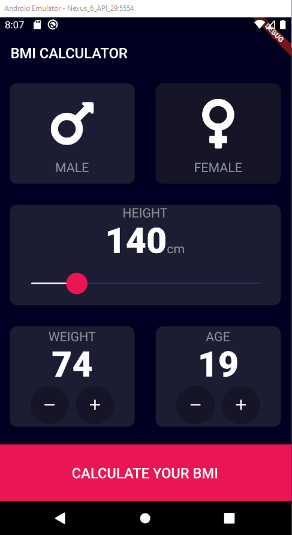

# BMI Calculator 💪



#### k convention
константы должны начинаться с буквы k.
```
kLabelTextStyle
```

#### функции высшего порядка
функции можно передавать как параметры функции, и их как и константы можно создавать вне класса

#### GestureDetector
Виджит *GestureDetector* позволяет отлавливать события, очень много колбэк функций. На таб, на поворот экрана и тд.